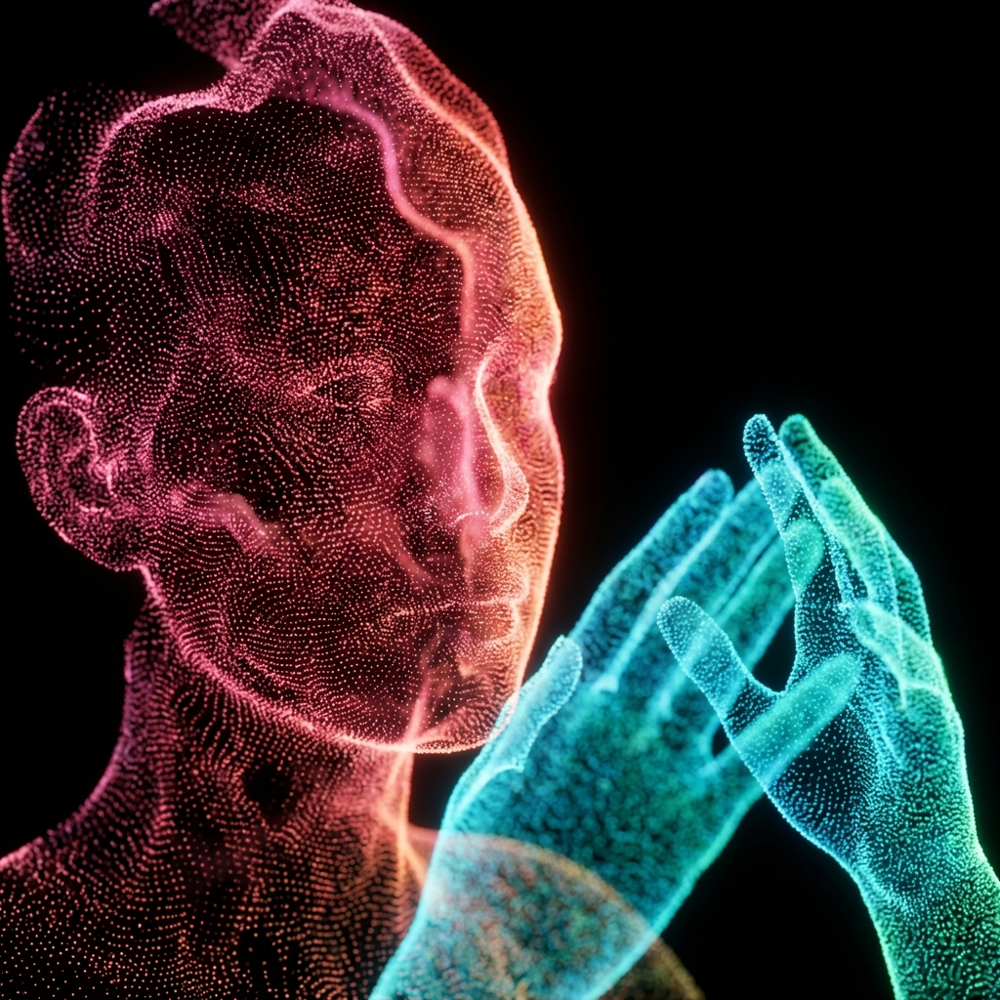

# Gesture Particles



A real-time 3D particle mirror visualization that reconstructs your face and hands using thousands of glowing particles. Built with Three.js and MediaPipe for webcam-based computer vision tracking.

**Created by Naoufal NAJIM**

## ✨ Features

- **Real-time Face Tracking**: 468 facial landmarks tracked at high precision
- **Hand Tracking**: Dual hand support with 21 landmarks per hand
- **UHD Particle Rendering**: 4x density multiplier for ultra-high-definition particle clouds
- **Organic Motion**: Shader-based noise and drift for lifelike particle movement
- **Color Gradients**: 
  - Face: Warm gradients (Pink → Red → Orange)
  - Hands: Cool gradients (Cyan → Blue → Green)
- **Smooth Interpolation**: Linear interpolation (LERP) for jitter-free tracking
- **Optimized Performance**: Efficient GPU-based particle system using `THREE.Points`

## 🎨 Visual Style

- **Background**: Pure black void
- **Particles**: Small, glowing points with additive blending
- **Effects**: Subtle noise drift for organic, alive feeling
- **Lighting**: Reduced intensity for realistic, non-blooming appearance

## 🚀 Installation

### Prerequisites

- Node.js (v14 or higher)
- npm or yarn
- Webcam access

### Setup

```bash
# Clone the repository
git clone https://github.com/naoufalnajim01/gesture-particles.git
cd gesture-particles

# Install dependencies
npm install

# Run development server
npm run dev

# Build for production
npm run build
```

## 🛠️ Technical Stack

- **Three.js**: 3D rendering and particle system
- **MediaPipe**: Face Mesh and Hands tracking
- **Vite**: Build tool and dev server
- **WebGL Shaders**: Custom vertex/fragment shaders for particle effects

## 📋 Project Structure

```
gesture-particles/
├── src/
│   ├── main.js              # Entry point and animation loop
│   ├── vision.js            # MediaPipe tracking manager
│   ├── particleSystem.js    # Three.js particle system with shaders
│   └── style.css            # Global styles
├── index.html               # HTML entry
├── demo.png                 # Demo screenshot
└── package.json             # Dependencies
```

## 🎯 How It Works

1. **Webcam Capture**: MediaPipe processes video frames to detect face and hand landmarks
2. **Coordinate Mapping**: 2D normalized coordinates (0-1) are mapped to 3D world space
3. **Particle Distribution**: Each landmark spawns multiple particles (density factor: 4x)
4. **Smooth Tracking**: LERP interpolation smooths particle movement
5. **Shader Effects**: GPU shaders add noise, glow, and color gradients
6. **Real-time Rendering**: 60 FPS rendering loop updates particle positions

## 🤖 Gemini 3 Prompt

This project was created using the following advanced prompt with **Google Gemini 3**:

```
Amega Yao {
  "project_name": "Gesture Particles",
  "role": "Expert Creative Coder / Three.js Developer",
  "prompt": {
    "context": "We are building a real-time 3D particle visualization driven by webcam computer vision data. You have access to `faceLandmarks` and `handLandmarks` provided by a Mediapipe tracker.",
    "goal": "Create a 'Particle Mirror' effect where the user's face and hands are reconstructed using a cloud of glowing 3D particles.",
    "technical_requirements": [
      "Use `THREE.Points` and `THREE.BufferGeometry` for high-performance rendering.",
      "Update particle positions every frame based on the incoming landmark data.",
      "Map the 2D normalized video coordinates (x, y) to 3D world space coordinates.",
      "Implement Linear Interpolation (Lerp) on the particle positions to smooth out jitter from the tracking data."
    ],
    "visual_style": {
      "background": "Black / Dark Void",
      "particles": "Small, glowing points with additive blending.",
      "color_palette": {
        "face": "Warm gradients (Pink, Red, Orange)",
        "hands": "Cool gradients (Cyan, Blue, Green)"
      },
      "effects": "Add a subtle noise or drift to the particles so they feel alive and organic, rather than static points."
    },
    "interaction": "The particles should follow the user's movements in real-time, functioning as a digital mirror."
  }
}
```

## 🎮 Usage

1. Open the application in a modern browser
2. Allow webcam access when prompted
3. Position your face and hands in front of the camera
4. Watch as particles reconstruct your movements in real-time!

## 📝 License

MIT License - see [LICENSE](LICENSE) file for details

## 👤 Author

**Naoufal NAJIM**

- GitHub: [@naoufalnajim01](https://github.com/naoufalnajim01)

## 🙏 Acknowledgments

- Three.js community
- MediaPipe team at Google
- Gemini 3 AI for code generation assistance

---

**Note**: This project requires webcam access and works best in well-lit environments with clear visibility of face and hands.
